# How the Claude Rating works, and the research behind it

The Free Agent Finder ranks players by the **Claude Rating**: how many fantasy points a player is projected to score over the rest of the current matchup, using this league's scoring. This page explains what went into it and what the research found, in plain language.

Last updated Oct 9, 2026 (findings through betting lines for goalies, availability, assists, upside and age). The research is ongoing; new findings are added here as they land.

**League scoring:** goals 2, assists 1, power-play points 0.5, shorthanded points 0.5, shots 0.1, hits 0.1, blocks 0.5. Goalies: win 2, loss -1, overtime loss +1, goal against -1, save 0.2, shutout 3.

## The short version

1. **Ice time is the best single predictor of next week**, and it should come from the last 5 to 10 games, because role changes show up there first. Scoring stats should use the whole season plus last season. A hot last 5 games is the weakest signal.
2. **Whether a player dresses matters more than anything else.** Scratches, injuries and trips to the AHL mean zero points. Accounting for that is worth more than any modeling trick.
3. **Goalies are all about starts.** Ranking goalies by points per game × team games is no better than picking at random. Ranking by expected starts is about 60% better.
4. **Blocks matter for defensemen only. Hits predict nothing useful for forwards.**
5. **Use all 6 moves each week, but make 4-5 on Monday and keep 1-2 for mid-week injuries** (section 31). Re-pick for the schedule rather than holding a pickup.
6. **Drop the player with the lowest projected week**, not the lowest season total. That doubles what each move gains.
7. **Empty lineup slots on light nights are the biggest pool of points left**, and the simple Monday plan captures them: add the 6 best projected weeks and drop your 6 lowest. Chasing single nights one at a time loses points.

## How the rating is calculated

- **Skaters:** projected points per game × games left this matchup × the chance he dresses.
  - *Points per game* comes from a model that weighs ice time and power-play time over the last 5, 10 and 20 games, plus shots, blocks, hits, points and expected goals from this season and last season.
  - *The chance he dresses* comes from how many of his team's last 3 and 10 games he played, then ESPN's injury status on top (out, IR or suspended counts as 0; day-to-day is capped at 50%). These overrides are logged daily so the day-to-day number can be checked after a few weeks.
- **Goalies:** expected starts in the team's remaining games × his points per start. Expected starts come from his share of recent starts and back-to-backs. Points per start is his own average this season blended with the league average of about 2.9, so his own number gets half the weight after 15 starts. When Daily Faceoff lists a goalie as the **confirmed** starter for tonight or tomorrow, that game counts as a certain start for him and zero for his partner (section 23).
- The badge next to the rating is the player's percentile among forwards, defensemen or goalies across the league.

## How it was tested

- Data: NHL game logs and MoneyPuck expected goals for five regular seasons, 2021-22 to 2025-26 (236,091 skater games, 13,932 goalie games), all scored with this league's settings.
- Each Monday, the model only sees games before that Monday and predicts the Monday to Sunday week that follows. A player who doesn't dress scores 0.
- "Wire players" means skaters outside the top 190 (about what 12 teams roster) who have played in the last 14 days, and goalies outside the top 30.
- Each test season (2023-24, 2024-25, 2025-26) is predicted by a model trained only on earlier seasons, which gives 72 test weeks.
- A second, independent review rebuilt the data from scratch to check the claims. Where it disagreed, the research was rerun (see the end of this page).

## 1. Which stats are stable

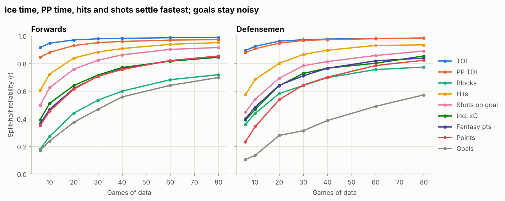

How much a stat in one set of 10 games tells you about another set of 10 games (1 = perfectly repeatable):

| Stat | Forwards | Defensemen |
| --- | --- | --- |
| Ice time | 0.97 | 0.96 |
| Power-play time | 0.93 | 0.95 |
| Hits | 0.84 | 0.80 |
| Shots on goal | 0.76 | 0.69 |
| Expected goals | 0.64 | 0.64 |
| Fantasy points | 0.62 | 0.64 |
| Blocks | 0.44 | 0.58 |
| Goals | 0.37 | 0.28 |

Ice time is almost perfectly repeatable. Goals are mostly noise over 10 games.

## 2. What predicts next week

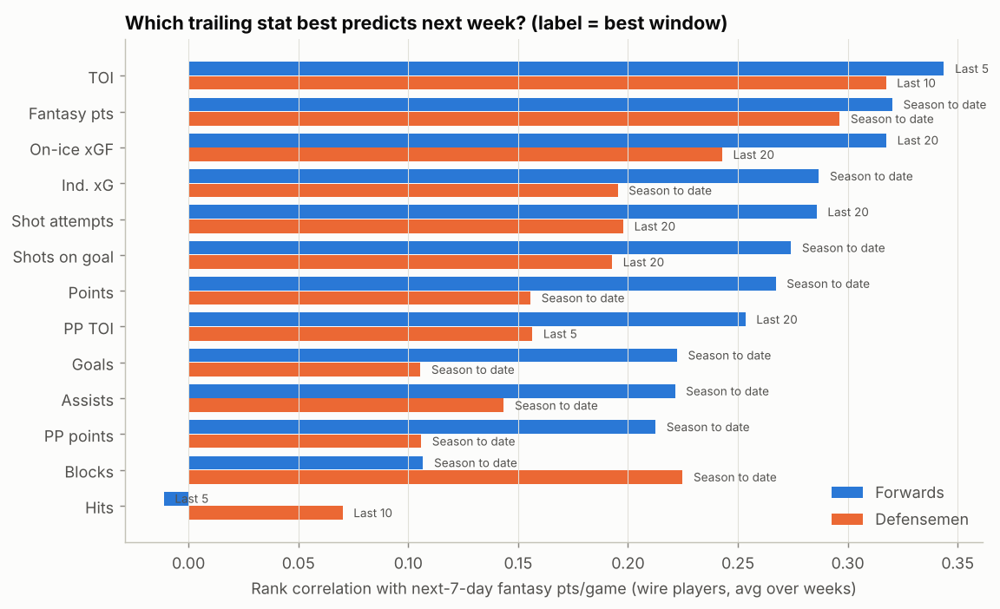

How well each stat ranks wire players by next week's points per game (higher is better):

- **Forwards:** ice time over the last 5 games 0.34, season points per game 0.32, on-ice expected goals 0.32, shots 0.27, power-play time 0.25, blocks 0.11, hits -0.01.
- **Defensemen:** ice time over the last 10 games 0.32, season points per game 0.30, blocks 0.23, shots 0.19, power-play time 0.16, hits 0.07.

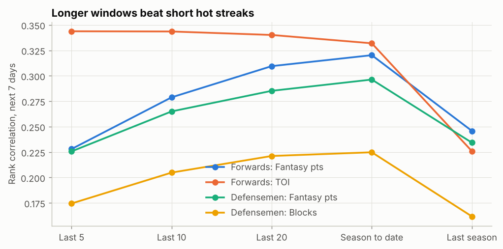

Fantasy points over the last 5 games score only 0.23, rising to 0.32 for the whole season. Hot streaks fade.

## 3. Choosing the model

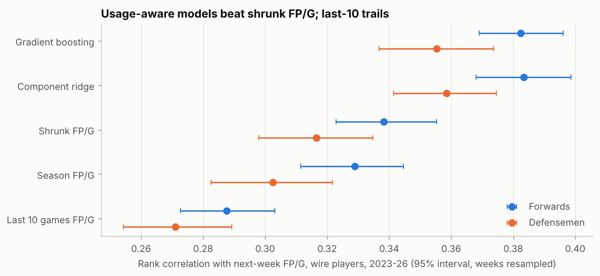

| Model | Forwards | Defensemen |
| --- | --- | --- |
| Last 10 games points per game | 0.29 | 0.27 |
| Season points per game | 0.33 | 0.30 |
| Season points per game, pulled toward last season | 0.34 | 0.32 |
| **Per-stat model with recent ice time (used on the site)** | **0.38** | **0.36** |
| Gradient boosting (more complex) | 0.38 | 0.36 |

The per-stat model wins in all three test seasons. The more complex model adds nothing, so the simpler one is used, which also lets the site explain each number.

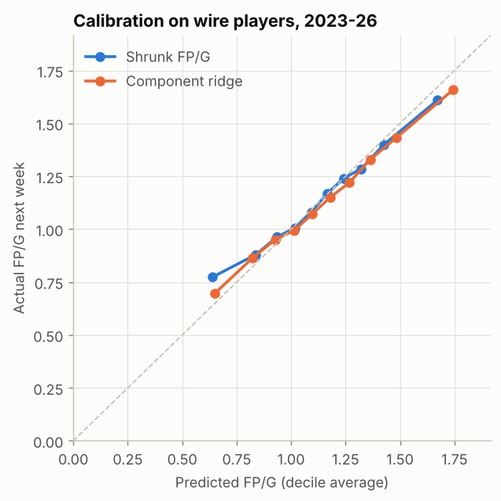

Its projections line up with what players actually scored, without bias up or down.

## 4. Will he dress?

Chance a wire player dresses for a team game, by how many of the team's last 3 games he played:

| Played in last 3 | Chance he dresses | Weeks with zero games |
| --- | --- | --- |
| 0 of 3 | 22% | 65% |
| 1 of 3 | 48% | 35% |
| 2 of 3 | 63% | 21% |
| 3 of 3 | 93% | 2% |

About 11% of wire player-weeks had zero games. The independent review found 24 to 26% when players who hadn't played recently were included, and showed that filtering for regulars raised the top 5 pickups from 5.0 to 6.5 points a week.

## 5. What it's worth when picking up players

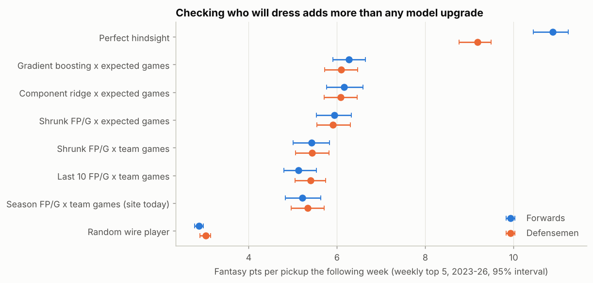

Points scored the following week by each method's top 5 wire picks:

| Method | Forwards | Defensemen | Picks who never played |
| --- | --- | --- | --- |
| Random wire player | 2.9 | 3.0 | |
| Points per game × team games (the old site) | 5.2 | 5.3 | 6% / 8% |
| **Claude Rating** | **6.2** | **6.1** | 1% / 2% |
| Perfect hindsight | 10.9 | 9.2 | |

That's about 1 extra point per forward pickup per week over the old ranking.

## 6. Goalies

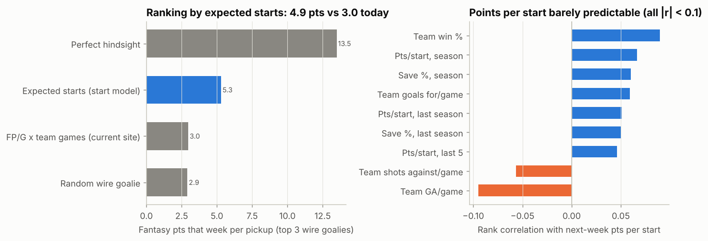

- **Starts:** the start model misses by 0.58 starts a week, versus 1.78 for assuming every team game. Starting the first night of a back-to-back nearly rules out the second night.
- **Points per start can't be predicted:** nothing tested ranks next week's points per start better than chance (all under 0.1). Team win % is the best at 0.09. So the site starts from the league average, about 2.9 points per start, and only slowly moves toward a goalie's own number (section 22).
- **Ranking wire goalies:** points per game × team games gives 3.0 points a week (random is 2.9). Expected starts gives 4.9.

### Rest and workload

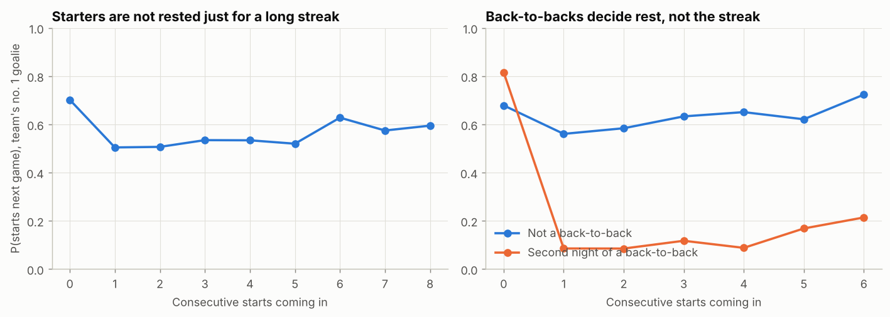

- A long run of starts doesn't get a starter rested: he starts the next game 50 to 63% of the time whether he has started 1 or 8 in a row.
- The back-to-back is what matters. On the second night, after starting the first, he starts only 9 to 20% of the time.
- Days since his last start: 1 day 11%, 2 days 57%, 3 to 5 days 71 to 76%, 7+ days under 50% (usually hurt or benched).
- Adding these to the start model cut its weekly error by 5%.

## 7. Would checking the news help?

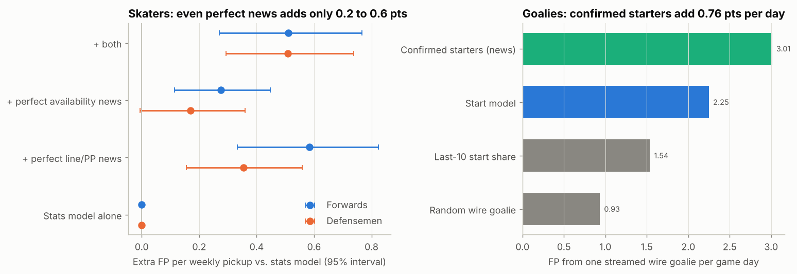

This measures the most news could ever add, by giving the model perfect knowledge of what news would report:

| What the news would tell us | Extra points |
| --- | --- |
| Forwards: exactly who dresses | +0.28 per weekly pickup |
| Forwards: next week's ice time and power-play role | +0.58 per weekly pickup |
| Defensemen: exactly who dresses | +0.17 per weekly pickup |
| Defensemen: next week's ice time and power-play role | +0.35 per weekly pickup |
| **Goalies: confirmed starters, streaming each game day** | **+0.76 per day** |

For skaters, even perfect news adds only 3 to 10%. For goalies it adds about a third, because the start model's top wire goalie actually started only 71% of the time. Starters are usually confirmed after the morning skate, so a goalie news check needs to run around midday ET on game days. The site now gets confirmed starters for free from Daily Faceoff (section 23).

## 8. Opponents, home ice and back-to-backs

| | Per extra goal the opponent allows per game | Home | Second night of a back-to-back |
| --- | --- | --- | --- |
| Forwards (avg 1.36 pts/game) | +0.07 | +0.06 | -0.05 |
| Defensemen (avg 1.43) | +0.05 | +0.02 | -0.01 |
| Goalies, per start (avg 3.17) | -0.25 per extra goal the opponent scores | +0.21 | +0.05 |

Opponent strength changes skater pickups by less than 0.02 points a week, so it's left out. For goalies, home ice is worth about 0.2 points a start, and a weak opponent is a reasonable tie-breaker.

## 9. Using all 6 moves

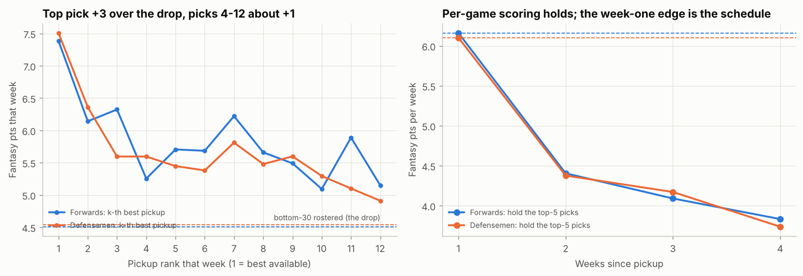

Compared with dropping a typical bottom-of-roster skater (about 4.5 points a week):

| Pickup that week | Net gain |
| --- | --- |
| Best available | about +3.0 |
| 2nd and 3rd best | about +1.5 |
| 4th to 6th best | about +1.0 |
| 7th to 12th best | +0.3 to +1.7, noisy |

- **Use all 6 moves.** Even the 6th pickup beats the drop by about a point a week. (Section 31 found it's better still to hold 1-2 of them for mid-week injuries.)
- **Re-pick each week.** A top pick scores 6.1 in his first week, then 4.4, 4.1 and 3.8. He's the same player per game; the first-week edge was his schedule, and some picks lose their spot over time.

## 10. Do ice-time jumps stick?

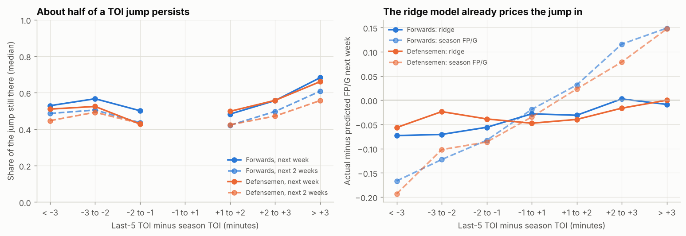

- **About half of an ice-time change lasts.** Jumps of 3+ minutes last best (66 to 68% still there the next week).
- **Power-play time is different.** A power-play time *increase* keeps only 17 to 28%, because short-term PP time mostly reflects how many penalties opponents took. A *decrease* keeps 58 to 66%. So "moved up to PP1" needs a confirmed unit change; "moved off PP1" can be trusted.
- The rating's model already accounts for this, so its error doesn't grow for players with big recent jumps.

## 11. Rookies and call-ups

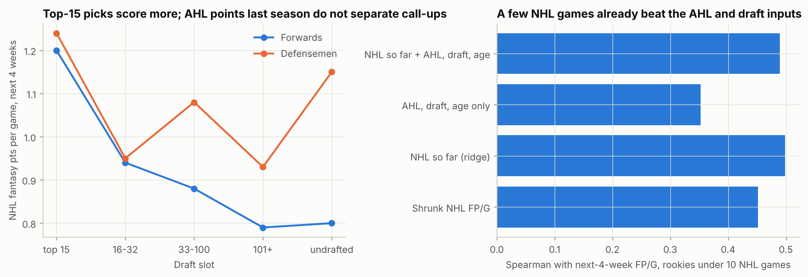

For players with fewer than 10 NHL games, their first few NHL games already predict better than their AHL scoring, draft slot or age. AHL points per game don't separate call-ups at all. What matters is the role he's given: his NHL ice time and power-play time. **No change to the rating**: a player with no NHL games gets the league average, and his minutes take over after one game.

## 12. Power-play unit and mid-season retraining

- **"On PP1"** looks important, but it adds nothing once the model knows his power-play minutes. It's a useful label, not an input.
- **Retraining during the season** doesn't help: a model trained on past seasons is as good in March as one retrained monthly. Accuracy rises through the season only because the season-to-date stats get longer. The model is trained once a year.

## 13. ESPN injury status

On Oct 8, six players ESPN listed as OUT were still rated 87 to 95% likely to dress, because they had played the games before getting hurt. ESPN's flag removes that lag. Among players who had dressed in all of their team's last 3 games, about 1% then scored a zero week, worth about 0.9 points per roster each week. The site now sets OUT, IR and suspended players to 0 and caps day-to-day at 50%.

## 14. Who to drop

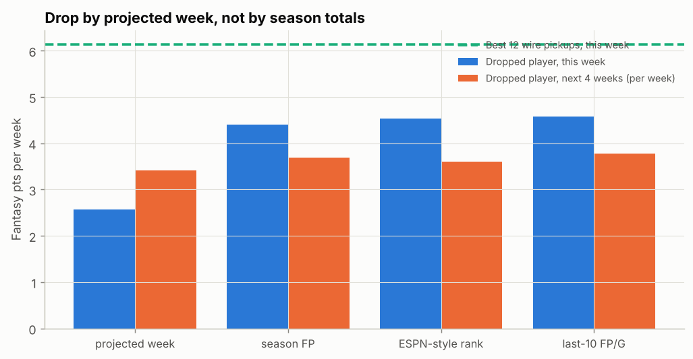

Four ways of picking the 12 rostered skaters to drop each week, against the 12 best free agent pickups (6.1 points that week):

| Drop the player with the lowest… | His points that week | Net gain from the move | Drops that outscore the pickup |
| --- | --- | --- | --- |
| **Projected points this matchup (Claude Rating)** | **2.6** | **+3.6** | 11% |
| Season points total | 4.4 | +1.7 | 24% |
| ESPN-style rank | 4.5 | +1.6 | 26% |
| Last 10 games points per game | 4.6 | +1.6 | 27% |

Dropping by projected points doubles what each move gains, partly because that player has fewer games or is less likely to dress that week. It doesn't cost you a better player later: the dropped players score about the same over the next month under every rule. The site's **Drop list** shows your team's five lowest projected skaters.

## 15. Light nights and open slots

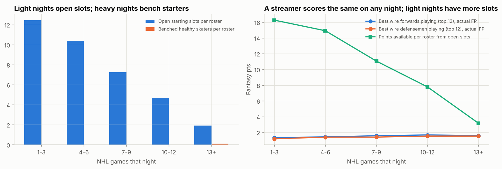

Simulating 12 rosters in this league's format:

| NHL games that night | Open lineup slots per roster | Points available from open slots |
| --- | --- | --- |
| 1-3 | 12.4 | 16.3 |
| 4-6 | 10.4 | 14.9 |
| 7-9 | 7.2 | 11.1 |
| 10-12 | 4.7 | 7.8 |
| 13+ | 1.9 | 3.2 |

- A typical roster has about 28 empty starting slots a week, worth about 72 points if every one were filled. About two thirds of that is on nights with 6 or fewer games. The 6-move limit means only part of it is reachable, but it's the largest pool of points in this study.
- A streamer scores about the same on any night, so what matters is simply whether he plays on a night your slot is open. The site's **Open** column counts exactly that for each free agent, for the team you pick.

## 16. The UTL slot

No skater in this league is eligible at both forward and defense, and the lineup uses general F slots, so forward eligibility never matters. UTL only comes into play on nights with 13+ games, and there the 6th defenseman outscored the 10th forward (1.40 vs 1.30 points). **The site counts UTL as a sixth D slot** when working out open slots.

## 17. Coming back from injury

Across 2,012 returns from absences of 2+ weeks, players scored at their old rate right away, even after 8+ weeks out. Ice time in the first 5 games back is only 0.1 to 0.35 minutes lower. **No change to the rating**: a returning player is rated on his pre-injury numbers.

## 18. Things that turned out not to matter

Each of these was added to the model and tested over three seasons. None changed its accuracy by more than a rounding error.

| Idea | Result |
| --- | --- |
| How much his team shoots and scores | Nothing. His own ice time, shots and expected goals already carry his team's pace. |
| Each team's goalie rotation habits | Teams differ, but the habit doesn't carry from one season to the next (it follows the goalies, not the coach). A per-team model was worse. |
| Hits for forwards | Worth exactly their 0.1 points each, no more and no less. Forwards who hit a lot score less only because they're fourth-liners. |
| Shot quality and finishing skill | Finishing is a real but small skill, and last season's goals and expected goals already capture it. |
| Stats from two seasons ago | Last season is enough. Two seasons back helps a tiny bit in October only. |

## 19. Moves: the Monday plan beats daily streaming

Simulating 12 rosters over 72 weeks, each with at most 6 moves a week:

| Strategy | Points per roster per week | vs. no moves |
| --- | --- | --- |
| No moves | 85.8 | |
| **Monday: add the 6 best projected weeks, drop the 6 lowest projected** | **91.2** | **+5.4** |
| Monday, matching pickups to your open-slot nights | 90.8 | +5.0 |
| Daily streaming: fill tonight's open slots until moves run out | 89.1 | +3.3 |

- **The simple Monday plan wins.** That's exactly the site's table (sorted by rating) plus the drop list.
- Matching pickups to open nights doesn't beat it, because the best projected week is usually a 4-game week anyway.
- Daily streaming spends moves on 1-point nights and loses about 2 points a week. Light nights are worth using, but through the weekly ranking, not one night at a time.

## 20. Streaming goalies by opponent

Over 101 weeks of picking the 3 best wire goalies:

| Ranked by | Points from top 3 picks per week |
| --- | --- |
| Expected starts | 5.19 |
| + home ice and opponent strength | 5.07 |
| **+ the goalie's own points per start, pulled toward the league average** | **5.33** |

Opponent strength is noise for goalies (it explains under 1% of points per start). A goalie's own points per start, blended with the league average so that one hot week doesn't swing it, adds a little. **The site now uses it** (section 22).

## 21. Should the rating show a confidence level?

No. Players with few games this season are not projected any worse: the model leans on last season for them, and they're mostly lower-usage players with less to swing. Weekly hockey scoring is noisy for everyone (the typical miss is about 0.55 points a game against an average of 1.3). A "low confidence" badge would tell you to distrust numbers that are as good as any other. Tap a row to see what drives a rating instead.

## 22. What changed on the site from this round

- **Goalies:** expected starts × his own points per start this season, blended with the league average of 2.9 (his own number gets half the weight after 15 starts). Worth about +0.14 points a week on the best streaming picks.
- Nothing else. Injury returns, team shooting, rotation habits, hits, shot quality, older seasons, opponent-based goalie streaming, night-by-night streaming and a confidence badge were all tested and left out.
- **Next to test:** comparing the rating with ESPN's projections over a few weeks of live data, using the log described in section 23.

## 23. Confirmed starting goalies, and what's being logged

The biggest gain left in the research was knowing tonight's starting goalie (section 7: about a third more points per streamed goalie). Daily Faceoff publishes it for every game, so the site now reads it directly, with no AI step needed.

- The site updates at **9 AM, 12:30 PM and 5 PM ET**. Starters are usually confirmed after the morning skate, so the midday run is the one that matters.
- A goalie Daily Faceoff marks **Confirmed** for tonight or tomorrow gets that game as a certain start, and his partner gets zero. A confirmed start on the first night of a back-to-back also lowers his chance of starting the second night. The row shows a "starts tonight" or "sits tonight" tag.
- "Likely" and unconfirmed goalies are shown when you tap the row but don't change the rating yet, until the log shows how often they're right.

Every update also saves a log (in `data/log`) of things that might help but need live data to test:

| Logged | Question it answers after three weeks |
| --- | --- |
| Daily Faceoff starters, every label, three times a day | How often "Confirmed" and "Likely" are right, and when they firm up |
| Daily Faceoff projected lineups, power-play units and scratches | Does "not in the projected lineup" predict a scratch better than the current dress estimate? |
| ESPN injury notes (expected return timing) | Do the notes predict games missed better than the flat 50% for day-to-day? |
| DraftKings moneylines and totals (from the NHL's site) | Do betting odds predict a goalie's points per start? |
| Each player's rating and ESPN's projection | Which one picks better free agents (section 25 of the research)? |

## 24. Betting lines for goalies

A goalie's points depend heavily on whether his team wins (a win and a loss are 3 points apart), and the betting line is the sharpest estimate of that. Across 3,308 starts with closing lines from 2021-22 and 2022-23:

| Chance to win, from the betting line | Starts | Points per start |
| --- | --- | --- |
| under 35% | 475 | 2.8 |
| 35-45% | 757 | 2.9 |
| 45-55% | 844 | 3.7 |
| 55-65% | 757 | 4.2 |
| over 65% | 475 | 4.0 |

- **The line is the first thing found that predicts points per start.** Season win %, goals against and shots against didn't (sections 6 and 20), because they're stale averages. The line already knows tonight's starters, rest and injuries.
- **The site now uses it for tonight's game:** about 2.9 + 4.1 × (win chance − 50%) points per start, so roughly 2.3 for a 35% underdog and 3.5 for a 65% favorite. The lines come from DraftKings through the NHL's site and only exist for today, so the rest of the week still uses the goalie's own points per start. Tap a goalie's row to see tonight's line.
- For skaters the line barely matters: players on teams expected to score 3.5+ goals score about 0.1 points more than usual. That's a tiebreak at most, so it isn't in the rating.

## 25. More ideas that didn't change anything

| Idea | Result |
| --- | --- |
| A fancier "will he dress" model (days since his last game, ice-time rank) | Slightly better, +0.02 points per pickup. The simple version stays. |
| Short-handed ice time | Shorthanded points are rare and unpredictable. No gain. |
| Separate models for forwards and defensemen | A hair better, within noise. |
| Primary vs. secondary assists | Primary assists are more repeatable, but the model already captures it. |
| An "upside" option for weeks you need a big score | High-ceiling players are just the high-projection players. When behind, pick the same players. |
| Two-week matchups | Same per-game projection × two weeks of games. |
| Age | Young players do improve and older ones decline, but recent ice time already shows it. |
| PDO and finishing luck | A player whose team shoots and saves unusually well with him on the ice (PDO), or who scores well above his expected goals, is mostly running lucky. The rating already expects him to cool off because it projects goals from shots and chances (see section 26). |

## 26. Expected vs. actual points

A second research thread built an expected-points number. It's what a player's season would be worth if his goals and assists matched the quality of chances he and his linemates created, keeping his shots, hits and blocks as they are.

- **Expected beats actual as a predictor.** Season expected points per game predicts the next month better than season points per game, in all three test seasons, especially for defensemen.
- **Most of a gap is luck.** About three quarters of the difference between a player's actual and expected points fades within 4 weeks. The luckiest tenth of wire players drop about 0.2 points a game, and the unluckiest rise about as much.
- **Not all of it, though.** Elite finishers like Kucherov, Draisaitl and Nylander beat their chances every year.
- **The rating already does most of this**, since it projects goals from shots and chances. So expected points don't change the rating. When you tap a skater's row, it shows his season points per game next to his expected points. Once he has 15+ games and the gap is 0.15 or more, it also says "running hot" or "running cold".

## 27. Goalie starts in the first two weeks

The start model was built on games from later in the season. On opening week it read one start as a 100/0 split, so after opening night it projected the backup for about 0.8 fewer starts over the next 4 games than backups actually got.

The site now blends in last season's split between a team's goalies until the team's 10th game, fading it out as games are played. Over four seasons this cuts the error in projected starts during a team's first 4 games from 0.84 to 0.67 per goalie. From game 10 on, nothing changes. Daily Faceoff confirmations still override on game days.

## 28. Two ratings: Week and Season

The site shows two numbers for every player:

- **Week** (the Claude Rating): projected points for the rest of this matchup. It counts games left, the chance he dresses, injuries and tonight's goalie news. Use it for this week's pickups and drops.
- **Season**: projected points per team game for the rest of the season. It's the same per-game projection without this week's schedule, and without ESPN's injury discount, so an injured star still rates as a star. For skaters it's projected points per game × how often he's been in the lineup. For goalies it's his share of his team's starts (this season, blended with last season's split over 10 games) × his points per start. Use it for keepers, trades and "is this a real player or a one-week stream".

Why one per-game projection works for the whole season: the research found a model trained for the next week and one trained for the next two weeks agree almost perfectly (0.999), and both predict longer stretches better than shorter ones. Each rating has its own percentile badge within forwards, defensemen or goalies.

## 29. Model upgrade: who plays, ice time, and goalie rest (Oct 9)

Three measured changes went into the rating together. All numbers are rank correlations tested on past seasons, each season predicted only from earlier ones.

| Change | What it does | Before | After |
| --- | --- | --- | --- |
| **Who plays next week** | The chance a skater dresses now comes from his lineup history this season: how many games in a row he has missed, how often he sits, his ice time in his last game, and whether past absences looked like scratches (1-2 games) or injuries (3+). A regular who sat the team's last game plays about 42% of next week's games, not the 61% the old table gave him. | Weekly total 0.637 (waiver pool 0.573) | 0.652 (0.594) |
| **Scoring rate per minute × recent ice time** | The model now also sees each player's points per minute (this season plus half of last, pulled toward the position average) times his ice time over the last 5 games, so a role change counts more for an efficient scorer. | Per game 0.520 (waiver 0.389) | 0.522 (0.393); first 6 weeks +0.005 |
| **Goalie rest and workload** | Start chances now use his run of straight starts, days since his last start, and team games and his starts in the last 7 days, not just back-to-backs. | Weekly starts off by 0.59 | 0.56 |

ESPN's injury status still sits on top: out, IR and suspended players are 0, and day-to-day players are capped at 50%. The cap is a ceiling, not a second discount, so a player already marked down for sitting isn't marked down twice.

Two ideas were left out: a luck correction for the luckiest tenth of players tested flat or negative, and a blend with a boosted-tree model added +0.002 at the cost of a new library in the daily job.

## 30. When a starting goalie is hurt

When ESPN marks a goalie out, the site used to set his starts to 0 but leave his partner's projection alone, so the backup looked like about 1 start in 4 games. Now the injured goalie's chance of starting each game goes to the healthy goalies on his team, so they share every game. When a regular starter (6+ of the team's last 10 starts) is out, his backup goes from 0.98 to 2.38 projected starts per 4 games, close to the 2.24 starts such backups actually got. A day-to-day goalie keeps half his chance, and the other half goes to his partner. Daily Faceoff confirmations still decide individual games.

## 31. Keep 1-2 moves for mid-week injuries

The Monday plan used to spend all 6 moves at once. A simulation of 12 rosters over 67 weeks tried holding some back: whenever a rostered skater misses his team's most recent game, swap him for the best free agent at his position for the rest of the week, and spend any held moves left on Thursday the usual way.

| Strategy | Skater points per roster per week | vs. all 6 on Monday |
| --- | --- | --- |
| All 6 on Monday | 93.9 | |
| **5 on Monday, 1 held for an injury** | **95.0** | **+1.1** |
| **4 on Monday, 2 held** | **95.3** | **+1.4** |
| 5 on Monday, 1 spent Thursday with no injury swap | 94.2 | +0.3 |

The 6th Monday move is worth about half a point to a point; replacing a player who has stopped dressing is worth 3-4, and a typical roster needs that about once every three weeks. Almost all of the gain is the injury swap, not the timing. ESPN's injury flags should do even better than "missed his last game" (a perfect flag gets +1.7 / +2.0).

**On the site:** the Upgrades card now has a **Mid-week swaps** list for your team: any skater ESPN lists as out, on IR or suspended, or who sat his team's last game while it still plays this week, next to the best free agent at his position by Week rating. Out and IR players are marked IR-eligible, so you can use the IR slot instead of dropping them. A day-to-day star who sat one game is usually better benched than dropped. Goalies weren't part of this test.

## What the independent review changed

| Review point | Outcome |
| --- | --- |
| Whether a player dresses is the biggest issue | Agreed. Scratches count as zero and the rating multiplies by the chance he dresses. |
| A simple "season points pulled toward last season" might match the fancy model | Rechecked over 3 seasons: the per-stat model beats it by +0.04 every season. The review reproduced this. |
| One test season can't separate models | Agreed. Now 3 seasons and 72 weeks. |
| Blocks look more stable when forwards and defensemen are pooled | Agreed. All numbers are within position. |
| Rank by projected points, not percentile | Agreed. The site sorts by points and shows percentile as a badge. |
| News should change games or ice time, not points directly | Agreed. That's how the news step is designed. |
